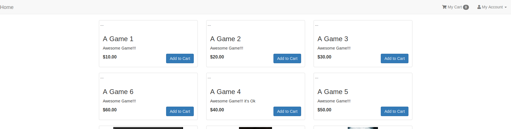
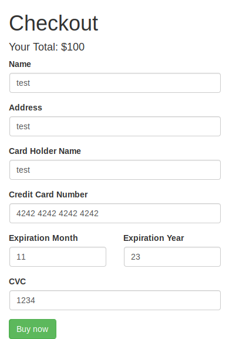

# expressCart

Carrito de compra con nodejs- express -mongodb -pug

Tiene algunas cosas corregidas del primer nodejs-shopping-cart .

Aqui renderizamos con pug y la compra no se admite si no estamos logueados.

Para comenzar:
npm install
npm start

